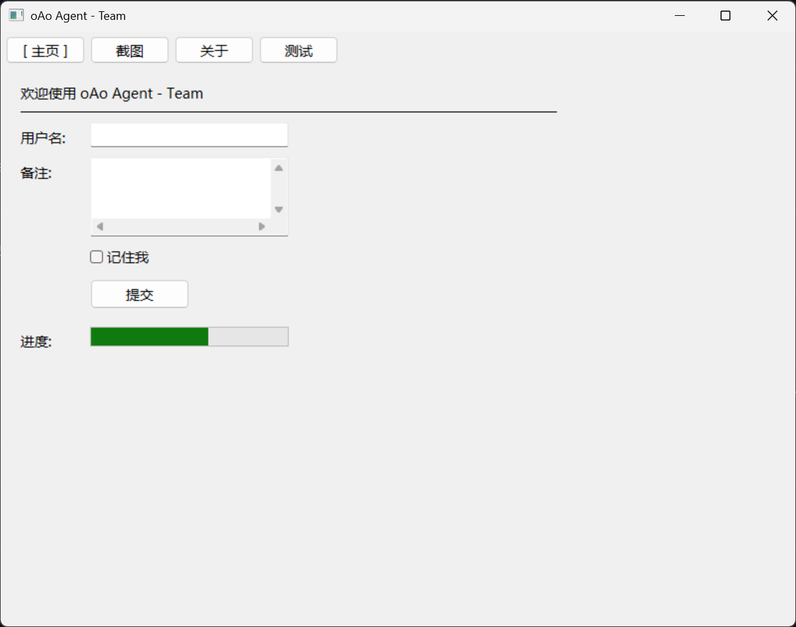
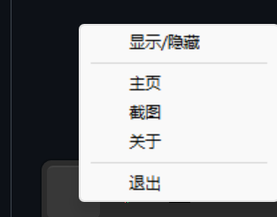
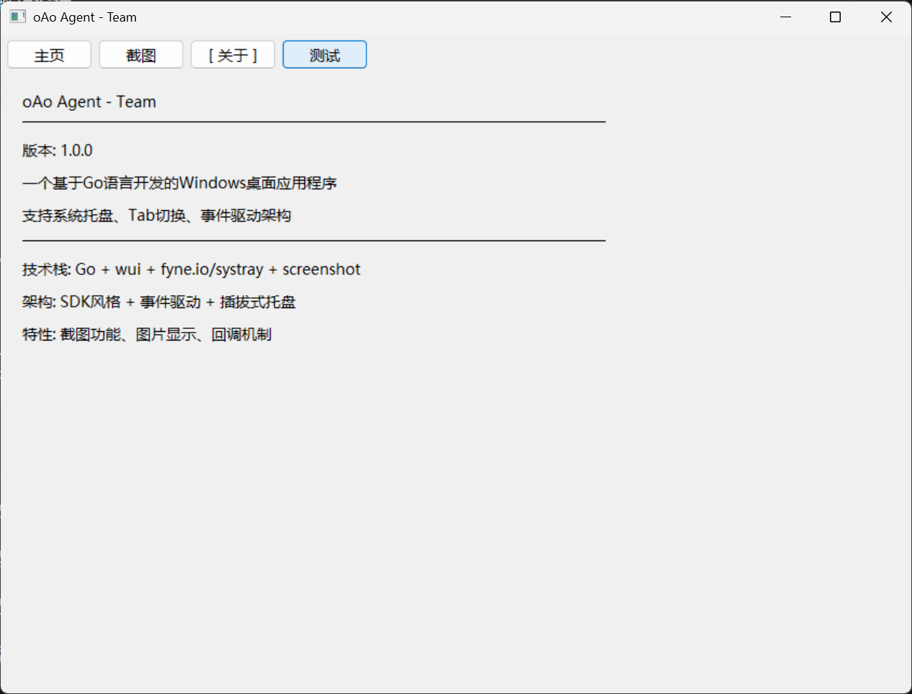

# oAo Agent - Team

A Windows desktop application developed in Go with SDK-style API design, featuring system tray support, multi-tab interface, event-driven architecture, and screenshot functionality.

[中文文档](README.md) | English

## Features

- 🎯 **Simple SDK-style API** - Create complete desktop apps with minimal code
- 🪟 **System Tray Support** - Minimize to tray and run in background
- 📑 **Multi-Tab Interface** - Flexible page switching and layout
- 🎨 **Chinese Font Optimization** - Default Microsoft YaHei, supports custom fonts
- ⚡ **Event-Driven Architecture** - Decoupled event system, easy to extend
- 🧩 **Rich UI Components** - Buttons, input fields, checkboxes, progress bars, etc.
- 📸 **Screenshot Functionality** - Hide window screenshot, image display, callback mechanism
- 🖼️ **Image Display** - Built-in image display component with save support

## Installation

### As a Go Module

```bash
# Install in your project
go get github.com/package-register/gui
```

Then import in your code:

```go
import "github.com/package-register/gui/sdk"
```

**Note:** For local development in this repository, you can use the local import path:
```go
import "gui/sdk"
```

### Clone Source Code

```bash
git clone https://github.com/package-register/gui.git
cd gui
```

## Quick Start

### Basic Usage

```go
package main

import (
    "github.com/package-register/gui/sdk"
)

func main() {
    app := sdk.New(
        sdk.WithTitle("My App"),
        sdk.WithSize(600, 400),
        sdk.WithTray("My App", nil),
        sdk.WithHideConsole(), // Hide console on release
    )

    // Register tab page
    app.RegisterTab("Home", func(t *sdk.TabContext) {
        t.AddLabel("Welcome", 20, 20, 400, 25)
        t.AddButton("Click Me", 20, 60, 100, 30, func() {
            // Button click handler
        })
    })

    // Register tray menu
    app.RegisterTray(func(t *sdk.TrayProxy) {
        t.AddMenuItem("Show/Hide", "", func() {
            app.ToggleWindow()
        })
        t.AddMenuItem("Exit", "", func() {
            app.Exit()
        })
    })

    app.Run()
}
```

### Screenshot Feature

```go
// Add screenshot tab
app.RegisterTab("Screenshot", func(t *sdk.TabContext) {
    // Screenshot button (hide window)
    t.AddScreenshotButton("Screenshot", 20, 20, 100, 30, true, func(img image.Image, err error) {
        if err != nil {
            log.Printf("Screenshot failed: %v", err)
            return
        }
        log.Printf("Screenshot successful: %dx%d", img.Bounds().Dx(), img.Bounds().Dy())
    })

    // Image display area
    imageDisplay := t.AddImage(20, 60, 400, 300)

    // Screenshot and display
    t.AddScreenshotButton("Screenshot and Display", 20, 370, 120, 30, true, func(img image.Image, err error) {
        if err == nil {
            imageDisplay.SetImage(img)
        }
    })
})
```

### Build & Run

```bash
# Development run (with console)
go run .

# Release build (pure GUI application)
go build -ldflags "-H=windowsgui" -o myapp.exe
```

## API Reference

### Configuration Options

| Option | Description |
|--------|-------------|
| `WithTitle(title)` | Set window title |
| `WithSize(width, height)` | Set window size |
| `WithTray(tooltip, icon)` | Enable system tray |
| `WithFont(name, size)` | Set font |
| `WithHideConsole()` | Hide console (only effective when compiled) |

### UI Components

| Component | Method | Description |
|-----------|--------|-------------|
| Label | `AddLabel(text, x, y, w, h)` | Display text |
| Button | `AddButton(text, x, y, w, h, onClick)` | Clickable button |
| Input | `AddEditLine(x, y, w, h)` | Single-line text input |
| Text Box | `AddTextEdit(x, y, w, h)` | Multi-line text input |
| Checkbox | `AddCheckBox(text, x, y, w, h, onChange)` | Selection box |
| Progress Bar | `AddProgressBar(x, y, w, h)` | Progress display |
| Separator | `AddSeparator(x, y, w)` | Horizontal separator line |
| Image Display | `AddImage(x, y, w, h)` | Image display component |
| Screenshot Button | `AddScreenshotButton(text, x, y, w, h, hideWindow, callback)` | Screenshot functionality |

### Screenshot Features

#### ScreenshotCallback
```go
type ScreenshotCallback func(img image.Image, err error)
```

#### ImageDisplay Component
```go
// Set image
imageDisplay.SetImage(img)

// Get image
img := imageDisplay.GetImage()

// Save to file
err := imageDisplay.SaveToFile("screenshot.png")
```

#### Screenshot Options
- **hideWindow=false**: Keep window visible during screenshot
- **hideWindow=true**: Automatically hide window during screenshot, restore after capture

### Event System

```go
app.OnEvent(event.AppStart, func(e event.Event) {
    // When app starts
})
app.OnEvent(event.AppExit, func(e event.Event) {
    // When app exits
})
app.OnEvent(event.TabSwitch, func(e event.Event) {
    // When tab switches
})
app.OnEvent(event.WindowShow, func(e event.Event) {
    // When window shows
})
app.OnEvent(event.WindowHide, func(e event.Event) {
    // When window hides
})
```

## Tech Stack

- **Go 1.21+** - Core language
- **wui** - Windows GUI framework
- **fyne.io/systray** - System tray support
- **kbinani/screenshot** - Screenshot functionality
- **Event-driven architecture** - Decoupled design

## Project Structure

```
gui/
├── main.go              # Entry point
├── sdk/
│   ├── gui.go           # Core SDK
│   ├── tab.go           # Tab context + screenshot features
│   └── tray_proxy.go    # Tray proxy
├── event/
│   └── event.go         # Event system
└── tray/
    ├── interface.go     # Tray interface
    └── fyne_adapter.go  # Tray adapter
```

## Screenshots


*Main Interface - Rich UI components*


*Screenshot Tool - Hide window screenshot and image display*


*System Tray Menu - Window control and quick switching*


*Multi-Tab Interface - Flexible page organization*

## License

MIT License
